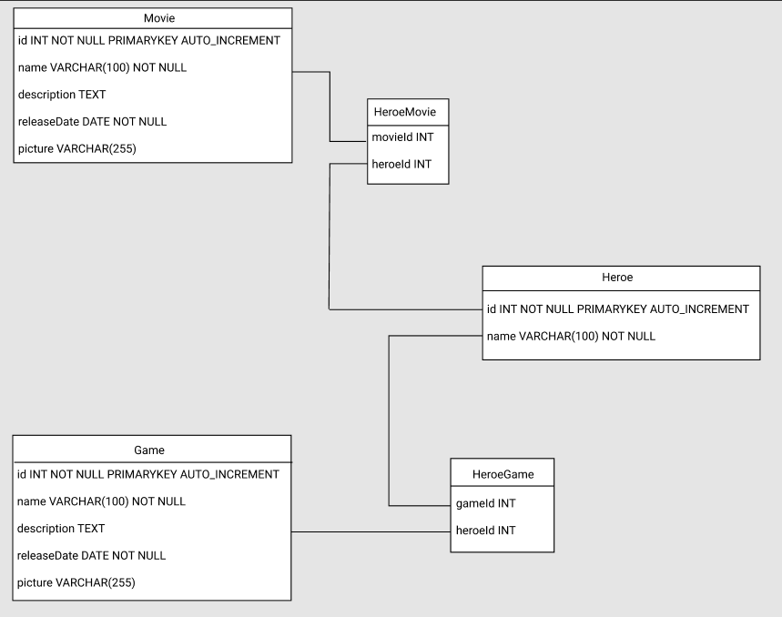

# checkpoint 4: Captain Comics backend structure

## Requirements

- [nodejs](https://nodejs.org/en/)
- [npm](https://www.npmjs.com/)

## Install

- Import database
```shell
mysql -u user -p database < db/captain-comics.sql
```

- Install Project
```shell
cp .env.example .env # and add your own environment variable
npm install
npm start
```

## Database structure



## Tools

### Eslint

[ESlint](https://eslint.org/) help you to find and fix problems in your JavaScript code.

You can launch eslint with :
```shell
npm run lint
```

Eslint is configured with [Husky](https://typicode.github.io/husky/#/) to be triggered in the `pre-commit` git hook.